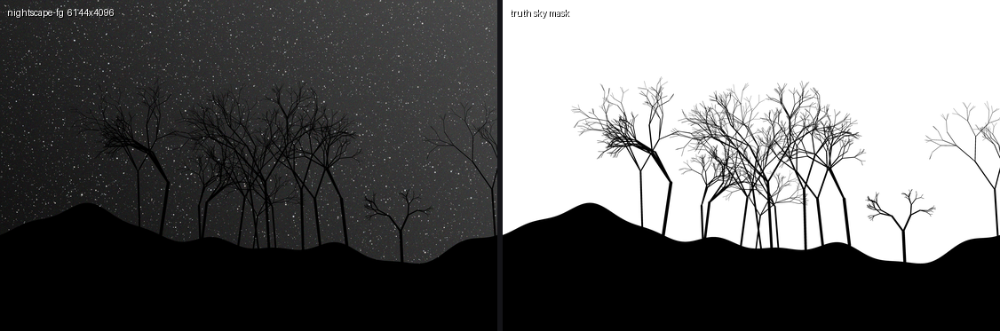
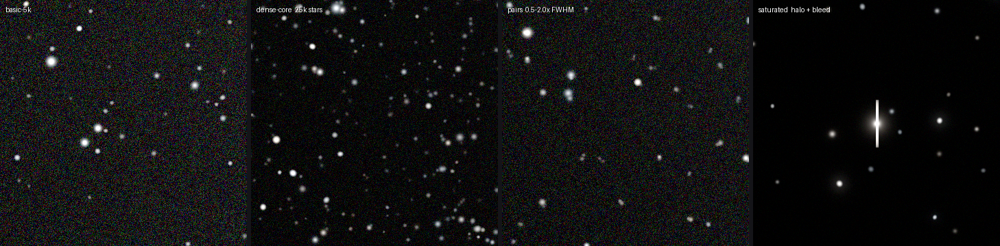

# StarKit

[](LICENSE)
[](ROADMAP.md)
[](Cargo.toml)
[](#测试)

**中文** · [English](README.en.md)

**星空摄影自动星点处理。** 星点检测 → 天空/地景门控 → 分级星点蒙版 → 参数化缩星与提亮星点，批处理输出确定性一致，可无损往返 Photoshop 工作流。



<sup>`nightscape-fg` 金标准夹具（左，为显示做了 asinh 拉伸）与其真值天空蒙版（右）。星点操作只允许发生在白色区域——这是结构性保证，不是约定俗成。两者由同一个 u64 种子生成。</sup>

---

## 问题

星野/深空后期中最耗时的两类操作，根因是同一个。

**缩星。** 叠加与拉伸之后，星点相对星云显得臃肿。手工流程——Photoshop 色彩范围选区 → 手工修蒙版 → 最小值滤镜 → 修补黑边和断裂星点——单张耗时 **15–40 分钟**，且几乎不可能在一个系列的多张作品之间保持一致。

**提亮星点。** 让主要亮星突出：复制图层 → 高斯模糊 → 滤色混合 → 手绘蒙版只保留主星 → 恢复过曝星核的颜色。同样繁琐，同样不可复现。

两者的瓶颈是同一件事：**生成一张精确、无瑕疵的星点蒙版。** 有了它之后，缩星和提亮都只是廉价的参数化运算。StarKit 自动化的正是这张蒙版——以及它下游的一切。

第三个问题是星野摄影特有的：**任何自动星点操作都绝不能碰地景。** 树、山脊线、建筑的高光会被粗糙的工具当成星点。在 StarKit 里，这不是尽力而为的启发式，而是结构性不变量（见下方 INV-1）。

## 项目状态

**Phase 0 已完成，关口 G0 于 2026-07-16 关闭。** 测量仪器就位，产品代码从 Phase 1（T1-1）开始。

| 任务 | 内容 | 状态 |
|---|---|---|
| **T0-1** | 合成金标准夹具生成器 | ✅ **已完成** |
| **T0-2** | Python oracle（photutils）——独立测量 | ✅ **已完成** |
| **T0-3** | 星表 schema v1 冻结 | ✅ **已完成** |
| **T0-4** | 本地 CI 脚本（`ci.sh`） | ✅ **已完成** |

规则（INV-5）是：**在能证明算法有效的仪器就位之前，不写算法。** 「召回率 98%」这类质量声明，如果没有已知精确真值的金标准数据加上一次独立的第二方测量，就是空话。Phase 0 把两者都建了起来——这也是为什么在此之前 `starkit-core` / `starkit-io` / `starkit-cli` 一直是空的。

> **已知欠债（[D-027](docs/DECISIONS.md)）：** 真实语料尚未到位，Phase 1 仅靠合成夹具推进。合成夹具能证明算法**正确**，只有真实作品能证明它**有用**——两者不可互相替代。因此 **关口 G1 在语料到位前无法关闭**（FR-2 真实图像验收、FR-4 摄影师签字、T1-10 均被阻塞）。

完整计划与任务 ID 见 [ROADMAP.md](ROADMAP.md)。每一个非平凡的选择都记录在 [docs/DECISIONS.md](docs/DECISIONS.md)。

**夹具已被证明可解。** 独立的 photutils oracle 在 `basic-5k` 上实测：

| 指标 | 门槛 | oracle 实测 |
|---|---|---|
| 召回率 @ SNR ≥ 5 | ≥ 98% | **99.21%** |
| 精确率 | ≥ 99% | **99.87%** |
| 质心误差中位数 | — | **0.056 px** |

这一步的意义：如果参考仪器自己都找不到这些星,那么任何关于 `starkit-core` 能找到它们的说法都毫无意义。这条线同时也成为 Phase 1 必须达到的标尺。

> 口径必须说清楚：真值 `snr` 是**单通道**峰值信噪比,而 oracle 实际测量的 RGB 均值图信噪比高 √3——所以标为 `snr=5` 的星在被测图上实为约 8.7 σ。**「SNR≥5 召回 98%」比字面听起来容易。** 详见 [D-017](docs/DECISIONS.md)。

## 目前已有：金标准夹具

`starkit-fixtures` 渲染合成星场，其真值**由构造决定即为精确**——真值星表是生成器的输入，而不是对其输出的测量。它刻意不与将来被它评判的算法共享任何代码（见 [docs/FIXTURES.md](docs/FIXTURES.md)）。



<sup>100% 裁切，asinh 拉伸。左上起顺时针：干净星场；银河核心级密度；过曝星及其光晕与溢出柱；间距 0.5–2.0 × FWHM 的近邻双星。</sup>

| Suite | 尺寸 | 星数 | 用途 |
|---|---|---|---|
| `basic-5k` | 4096² | 5,000 | 干净星场，峰值 SNR 3–200 · 主力指标 suite |
| `dense-core` | 4096² | 25,000 | 银河核心级密度 · 去混叠压力测试 |
| `saturated` | 2048² | 500 | 约 10% 过曝，带光晕与溢出结构 |
| `pairs` | 2048² | 2,000 | 间距 0.5–2.0 × FWHM · 去混叠极限 |
| `nightscape-fg` | 6144×4096 | 8,000 | 程序化山脊线 + 树木剪影，附真值天空蒙版 |

渲染模型：Moffat + 椭圆高斯 PSF，×8 超采样积分 · 幂律流量分布 · 逐星颜色偏色 · 泊松散粒噪声 + 高斯读出噪声 · 16-bit 量化与饱和。

真值星表与生成参数提交在 [`fixtures/expected/`](fixtures/expected)；图像本身可重新生成、不入库，由 `MANIFEST.sha256` 钉住哈希。

## 快速开始

```bash
./ci.sh          # 全部检查：fmt、clippy、52 个 Rust 测试、29 个 oracle 测试、
                 # 夹具确定性冒烟。约 25 秒，任何一项失败即非零退出。
./ci.sh --full   # 追加约 6 分钟的全尺寸验收测试
```

重新生成夹具图像（约 400 MB，release 下约 6 分钟；`--seed` 默认取各 suite 的规范种子）：

```bash
cargo run --release -p starkit-fixtures -- gen --suite all --out fixtures/generated
```

验证完整验收标准——重新生成全部五个 suite 各两遍，检查逐字节一致以及与已提交 manifest 的吻合：

```bash
cargo test --release -- --ignored
```

## 仓库结构

| 路径 | 职责 |
|---|---|
| `crates/starkit-core` | 纯算法：背景建模、检测、蒙版、门控、缩星、提亮。无 I/O。 |
| `crates/starkit-io` | 唯一接触文件与编解码的 crate：TIFF/PNG/JPEG、ICC/EXIF、原子写入。 |
| `crates/starkit-cli` | 命令行（`starkit`）、预设、批处理、逐图 JSON 报告。 |
| `crates/starkit-fixtures` | 金标准星场生成器——独立代码路径，不得依赖 `starkit-core`。 |
| `oracle/` | Python（photutils）独立测量。永不与 Rust 侧共享代码。 |
| `fixtures/expected/` | 已提交的真值星表、参数、报告、`MANIFEST.sha256`。 |
| `tools/` | 文档工具——如 `make_previews.py`，用于渲染上面的预览图。 |

## 不变量

以下每一条都是发布阻塞项，且相关代码一旦存在就必须有测试覆盖。

- **INV-1 蒙版门控**——所有星点操作被限制在 `sky_mask ∧ dilate(star_mask)` 之内。此外的像素与输入**逐位一致**；由单一合成器结构性强制，并以零容差金标准 diff 验证。
- **INV-2 确定性**——同输入 + 同参数 ⇒ 输出逐位一致。不依赖时钟，不依赖线程顺序；随机性一律经由显式种子。
- **INV-3 输入安全**——输入文件永不被修改；所有写入走同一条原子路径 临时文件 → fsync → 重命名。崩溃绝不留下半成品。
- **INV-4 线性光**——光度运算在线性空间进行；gamma/ICC 转换只在 I/O 边界发生。
- **INV-5 夹具优先**——在夹具与 oracle 通过 Phase 0 验收之前，不写产品代码。
- **INV-6 许可**——只用宽松许可依赖（MIT / Apache-2.0 / BSD / Zlib / ISC）。不引入 StarNet 权重及其衍生物。
- **INV-7 core 纯净**——`starkit-core/src` 不使用文件系统、网络、时钟或环境变量。

## 测试

`cargo test --workspace` 约四秒跑完 43 个 Rust 测试：PSF 与光度学单元测试、每一种产出物类型的逐字节一致性、以及全部五个 suite 已提交真值星表的 schema 与星群校验。

`pytest oracle` 约一秒跑完 23 个 oracle 测试：T0-2 的验收标准、`docs/FIXTURES.md` 里的匹配规则、以及各项指标的语义。它们断言的是**已提交的报告**，因此既不需要那 400 MB 图像、也不需要六分钟的重新生成；用 `python oracle/run_suites.py` 可从图像重建这些报告。

两个全尺寸验收测试会重新生成全部五个真实 suite（约 10⁸ 次泊松抽样，release 下约 6 分钟），它们被标记为 `#[ignore]`，好让默认测试快到人们真的愿意跑——见 [D-011](docs/DECISIONS.md)。它们是被门控，不是被跳过：`cargo test --release -- --ignored`。

**确定性的适用范围：** 逐字节一致性保证的是同平台、同工具链，这正是 INV-2 所要求的。**跨平台**一致性并不保证——`rand_distr` 的采样器会把超越函数交给平台 libm——因此已提交的 manifest 钉住的是本平台的输出。详见 [D-012](docs/DECISIONS.md)；CI 如何处理这一点在 T0-4 决定。

## 路线图

| 阶段 | 范围 | 关口 |
|---|---|---|
| **0** | 金标准夹具 + Python oracle + 本地 CI | G0 |
| 1 | MVP CLI：I/O、检测、手动天空蒙版、星点蒙版、缩星、批处理 | G1 |
| 2 | 自动天空分割、提亮、无星层/纯星层、GUI | G2 |
| 3 | 天体测量星座模式、ML 去星、wgpu、PS 插件桥 | G3 |

阶段是关口锁定的：上一个关口的检查清单未全部完成，下一阶段不得开始。

## 文档

- [PRD.md](PRD.md) —— 权威功能规格（v1.0，已批准）· [中文版](docs/PRD-zh.md)
- [ROADMAP.md](ROADMAP.md) —— 阶段、任务 ID、验收标准
- [docs/FIXTURES.md](docs/FIXTURES.md) —— 夹具规格 + 星表 schema v1
- [docs/DECISIONS.md](docs/DECISIONS.md) —— 只增不改的决策日志
- [CLAUDE.md](CLAUDE.md) —— 实现方（Claude Code）的工作规则

> 规格以英文版 [PRD.md](PRD.md) 为实现依据；中英两版冲突时以英文为准。

## 许可

MIT —— 见 [LICENSE](LICENSE)。
